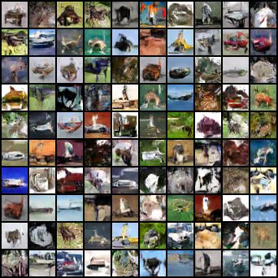
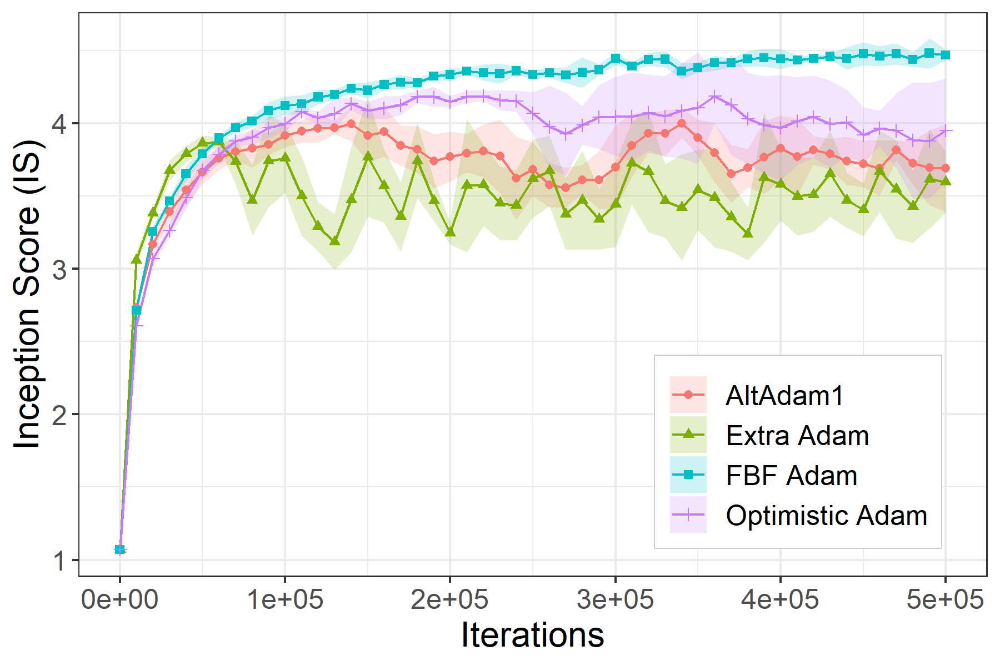
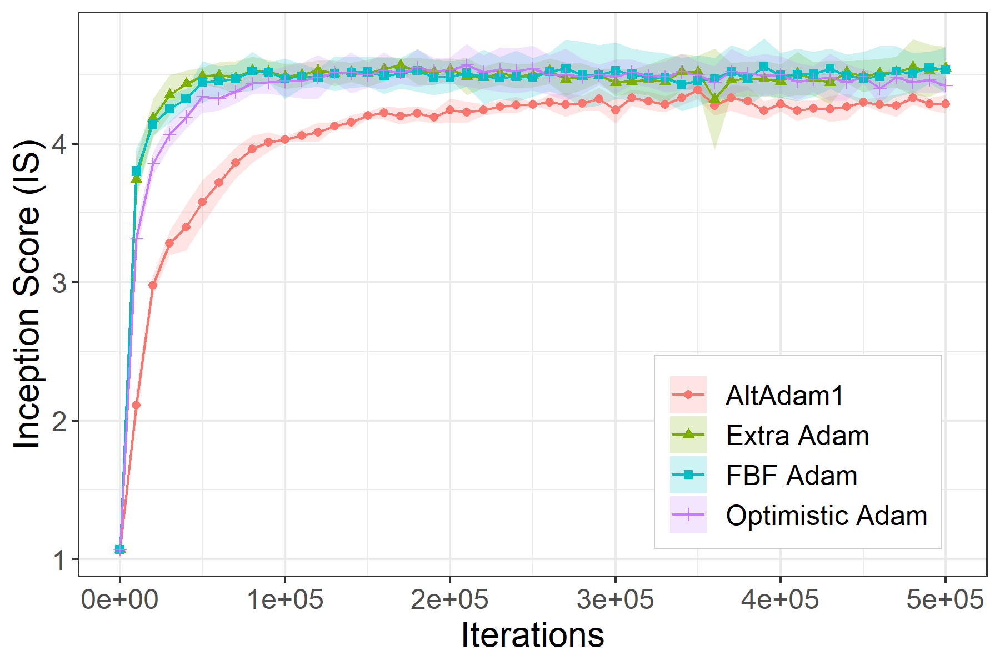

# Code for a [Two steps at a time --- taking GAN training in stride with Tseng's method]()

This is the code associated with the paper [Two steps at a time --- taking GAN training in stride with Tseng's method]().
If you find this code useful please cite as:

**Axel Böhm, Michael Sedlmayer, Robert Csetnek, Radu Bot [Two steps at a time --- taking GAN training in stride with Tseng's method](), 2020**

The code base was mostly taken from [here](https://github.com/GauthierGidel/Variational-Inequality-GAN) associated with the paper [A Variational Inequality Perspective on Generative Adversarial Networks](https://arxiv.org/abs/1802.10551).

## Requirements

The code is in `pytorch` and was tested for:
- pytorch=1.3.1

(Optional) The inception score is computed using the updated implementation from [A Note on the Inception Score](https://arxiv.org/abs/1801.01973) which can be found [here](https://github.com/sbarratt/inception-score-pytorch).

A conda environement is also provided (requires CUDA 10):
`conda env create -f environment.yml`

## `class FBF`

The Forward-Backward-Forward method is packaged as a `torch.optim.Optimizer` with an additional method `extrapolation()`. Two variants are available `FBFSGD` and `FBFAdam`.

Example of how to run `FBF`:
```python
for i, input, target in enumerate(dataset):
    FBF.zero_grad()
    output = model(input)
    loss = loss_fn(output, target)
    loss.backward()
    if i % 2:
      FBF.extrapolation()
    else:
      FBF.step()
```

## Experiments

To run the WGAN experiment with weight clipping using FBFAdam and the DCGAN architecture on CIFAR10 with the parameters from the paper:
`python train_fbfadam.py output --default --cuda`

To run the WGAN-L1 experiment with L1 regularization using FBFAdam and the DCGAN architecture on CIFAR10 with the parameters from the paper:
`python train_fbfadam.py output --default --cuda -rp 0.0001`

The `--default` option loads the hyperparameters used in the paper for each experiments, they are available as JSON files in the `config` folder.

The weights for our WGAN-L1 and DCGAN model trained with FBFAdam are available in the `results` folder.

For evaluation:
`python eval_inception_score.py results/FBFAdam/best_DCGAN_WGAN-L1.state`
and
`python eval_fid.py results/FBFAdam/best_DCGAN_WGAN-L1.state`

An `ipython` notebook is also available for the bilinear example [here](bilinear_wgan_prox.ipynb).

## Results



IS of all compared methods for WGAN (with weight clipping):


IS of all compared methods for WGAN-L1:

